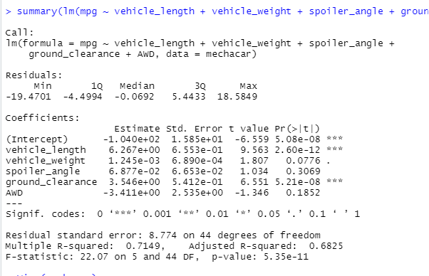
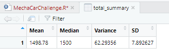
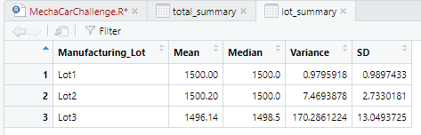
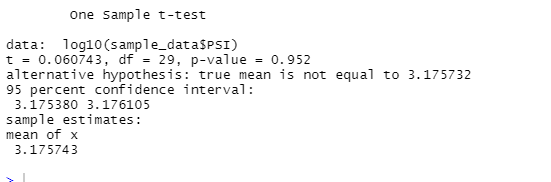

# MechaCar_Statistical_Analysis

## Linear Regression to Predict MPG

### Summary

Vehicle weight provided a non-random amount of variance to the mpg values in the dataset.
The slope of the linear model is considered to be zero because the p value (5.35e-11) of the linear model is smaller than the significance of 0.05.
This linear model does not predict mpg of MechaCar prototypes effectively because the intercept is statistically unlikely to provide random amounts of variance to the linear model. Meaning there are other variables and factors that contribute to the variation in mpg that have not been included in our model.

## Summary Statistics on Suspension Coils

### Summary

As per the summary of total lots it's evident that the variance is within the 100 pounds per square inch.

But when the summary of lot wise production is seen lot 3 stands out of the 3 lot as variance of lot 3 exceeds 100 pounds per square inch. 

## T-Tests on Suspension Coils

### Summary

When we run a t-test random sample of the PSI versus the population of manufacturing lots we see that the p-value we get is 0.952 which means that it is above our significance level of 0.05. Therefore, we do not have sufficient evidence to reject the null hypothesis, and we would state that the two means are statistically similar. 

When we run a t-test of lot 1 versus the population of manufacturing lots we see that the p-value we get is 0.00000000000935 (9.35e-12) which means that it is far below our significance level of 0.05. Which means there is a statistical difference between the observed sample mean and its population mean.

When we run a t-test of lot 2 versus the population of manufacturing lots we see that the p-value we get is 0.0005082 which means that it is far below our significance level of 0.05. Which means there is a statistical difference between the observed sample mean and its population mean.

When we run a t-test of lot 3 versus the population of manufacturing lots we see that the p-value we get is 0.1549 which means that it is above our significance level of 0.05. Therefore, we do not have sufficient evidence to reject the null hypothesis, and we would state that the two means are statistically similar.

THis says that although the random sample is similar to the population, lots 1 and 2 independently differ statistically.

## Study Design: MechaCar vs Competition

For the statistical study that can quantify how the MechaCar performs against the competition I would consider the metric of fuel efficiency for the city and highway driving along with year of manufacture, vehicle weight, AWD, cyl displacement and number of cylinders.
The null and alternative hypothesis will be as below
H0:Key metrics identified contribute to vehicle fuel efficiency
Ha:Metrics other than identified contribute to vehicle fuel efficiency
I will use the Multiple linear regression as the statistical test. THe reason is to narrow down the dependent variable which contributes majorly to the fuels efficiency of the vehicles.
We will need the comprehensive data of values of a range of cars both of MechaCar and competition for the following variables
Year of manufacture
Vehicle weight
Model
Displacement
Cylinders
City eff
Hwy eff
AWD
